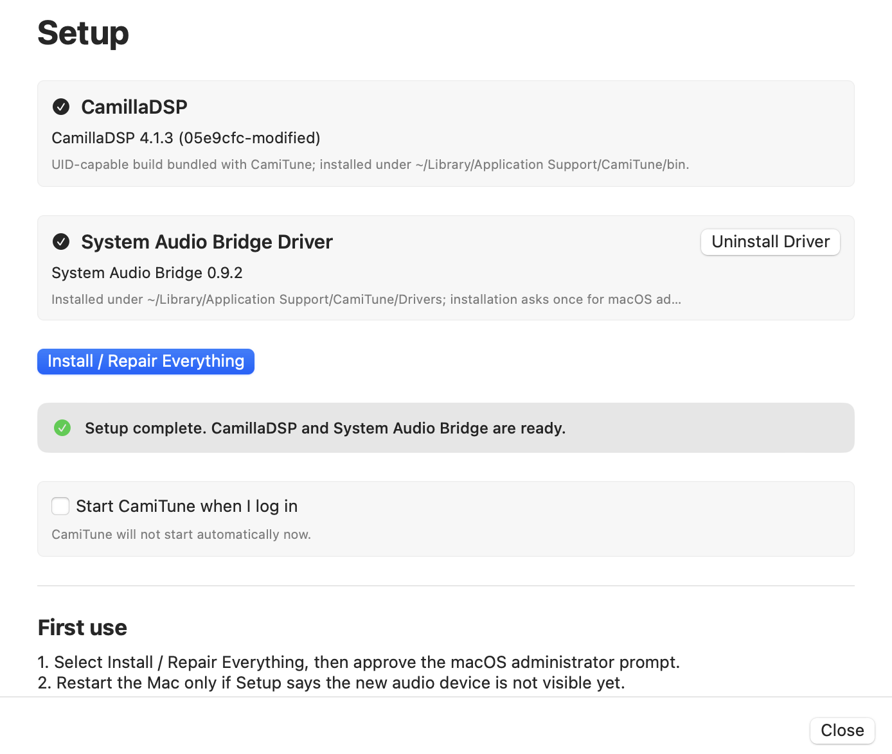
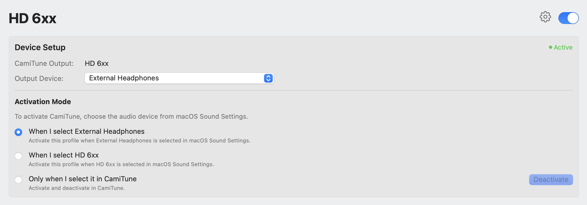
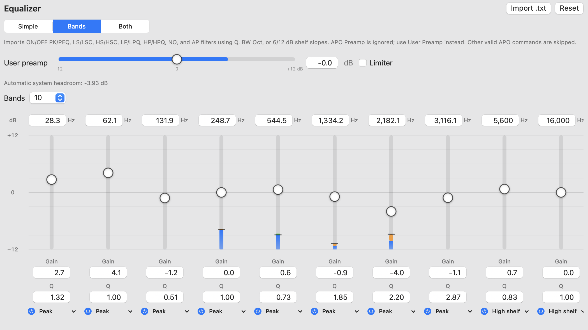
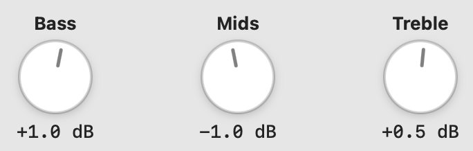
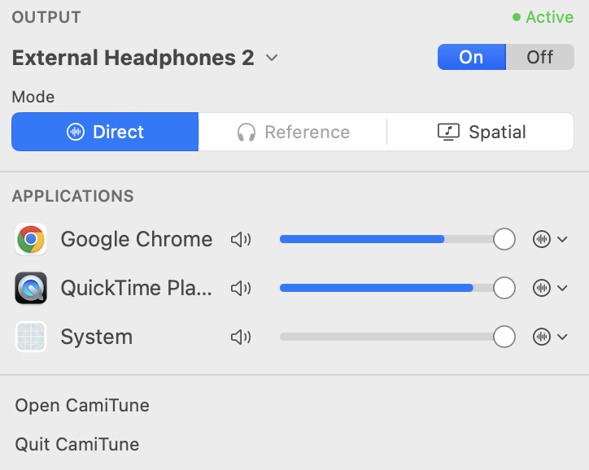
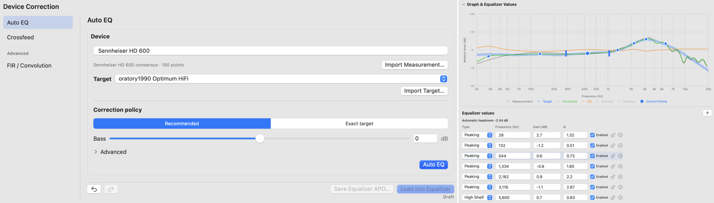
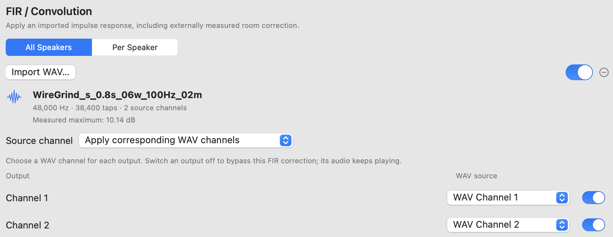
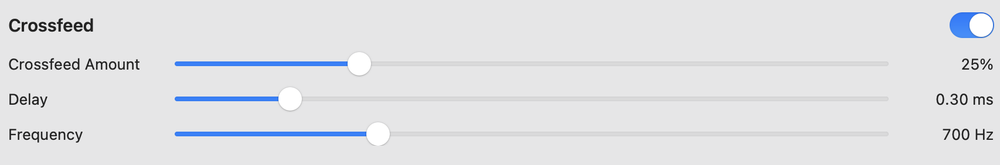
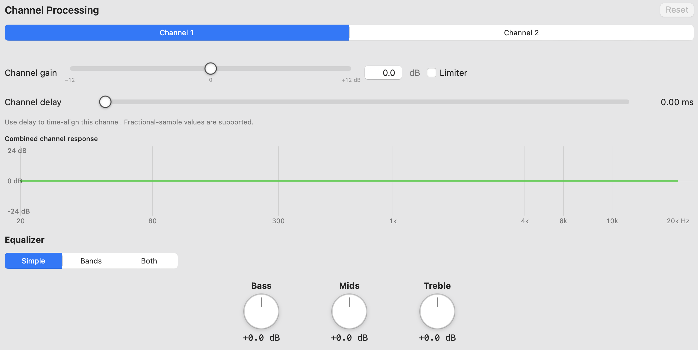
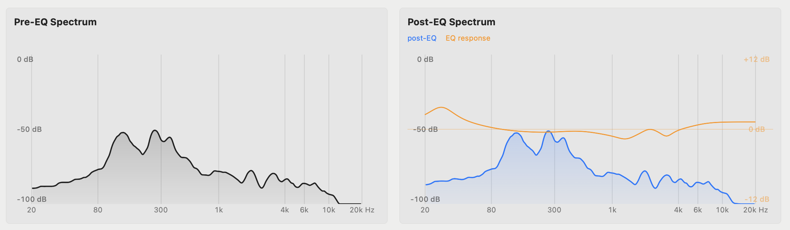

  

<h1 align="center">CamiTune</h1>

  A native macOS app for tuning system audio. Powered by CamillaDSP.

  
  
  
  

CamiTune gives macOS a proper **system-wide parametric equalizer** with an easy-to-use app interface. Each EQ band gives you direct control over its **frequency**, **gain**, **Q (bandwidth)**, filter type, and on/off state, with real-time pre-EQ and post-EQ response curve readings.

CamiTune can remember separate settings for each audio device and apply the correct profile automatically when you switch devices.

It’s also ultra-lightweight and designed for minimal system resource usage, with fast and efficient audio processing running quietly in the background without getting in your way.

## Highlights
- System-wide audio processing
- Output profiles with automatic device switching
- Per-app volume, mute, EQ
- Simple 3-band tone controls
- Up to 20-band parametric EQ
- Live spectrum and level monitoring
- Menu-bar controls
- Equalizer APO txt import
- Speaker/headphone/IEM correction
- Automatic headroom management
- FIR convolution and IR support
- Limiter / clipping protection
- Per-channel processing
- Built in drivers installation and diagnostics

## Core Features

### Guided setup

Set up everything directly inside the app with **built-in drivers installation and verification** with simple **Install / Repair**. 

### Output profiles

Create separate profiles for headphones, speakers, DACs, audio interfaces, or other outputs.

**Each profile can store its own:**
- Physcial output
- Sample rate
- Equalizer
- Device correction
- FIR processing
- Channel processing

Profiles have **3 activation mode**: when physical device in used, selected profile device, manual activation. 

### Parametric equalizer

CamiTune includes an editable parametric equalizer with up to **20 bands**.

Equalizer APO txt can be imported and edited visually inside CamiTune.

### Simple EQ

For faster adjustments, CamiTune also provides **bass, mids, treble controls**.

### Per App Audio

Each app gets **independent volume, mute, EQ**. Also support menu bar control.

Menu bar will also indicate if CamiTune is activated.

### Device Correction

###### Auto EQ

CamiTune has **auto EQ** for IEM, headphones, and even speakers. Allow dragging curves, or inserting values for fine tune.

###### FIR convolution

###### Headphone crossfeed

### Per-channel processing

### Live Spectrum

***

## Setup

### Requirements

- macOS 13 Ventura or newer.

## Install CamiTune

### 1. Download the app

Open the repository's **Releases** page and download `CamiTune-v0.x.x-app.zip`.

### 2. Move it to Applications

Extract the archive and move `CamiTune.app` into the Applications folder.

### 3. First Launch

CamiTune releases are currently not Developer ID signed, so macOS will probably block its first launch:

1. Attempt to open CamiTune ince
2. Open **System Settings → Privacy & Security**.
3. Scroll down to **Security** and select **Open Anyway** beside CamiTune.
4. Confirm with your password or Touch ID, then select **Open**.

macOS saves the app as an exception, so you normally need to do this only once.

***
## Privacy
- No analytics or tracking
- Adminstrator authentication is only used for drivers installation
- Logs are not submitted

## Current limitations

- CamiTune does not detect or disable unrelated system-EQ applications.
- Echo for sharing entire screen for people watching it cannot be eliminated, it can only be solved if the app have screen recording permission and I don't want it. I have planned to implement core audio tap in the future to eliminate this problem, however macOS 13 cannot be supported.

***
## Roadmap

### v 0.3.1
- Room correction
- allow per app bypass

### v 0.4
- Spatial Render

***

## Troubleshoot

- **The app will not open:** try once, then use **System Settings → Privacy & Security → Open Anyway**.
- **System Audio Bridge is missing after installation:** restart your Mac, then reopen CamiTune.
- **There is no sound:** deactivate the profile, confirm the physical output works normally, then reopen Setup and run **Install / Repair Everything**.
- **The spectrum does not move:** run **Recheck**, confirm System Audio Bridge is installed, and reactivate the profile. Confirm that the app reports it as active.
- **The duck menu-bar icon is hidden:** your menu bar may be full. Temporarily close another menu-bar app; when the duck appears, hold **Command** and drag it farther left.
- **The app uses lots of resources:** when the app window is opened, it needs to calculate the live spectrum graphs, simply close the window app and leave it on the menu bar.

***
## Build from source

A full Xcode installation is required. Swift 5.9 is used by the project.

***

## Third-party software

- [CamillaDSP](https://github.com/HEnquist/camilladsp) — With UID patch and bundles. Licensed under GPL-3.0 or MPL-2.0 for the macOS build used here.
- [BlackHole](https://github.com/ExistentialAudio/BlackHole) — the System Audio Bridge driver included with CamiTune is a modified, output-only derivative of BlackHole and is licensed under GPL-3.0.
- [AutoEq](https://github.com/jaakkopasanen/AutoEq) - some bundled Device Correction target data is derived from AutoEQ resources. AutoEq is licensed under the MIT License.
- [PublicGraphTool](https://github.com/HarutoHiroki/PublicGraphTool) - some bundled Device Correction target data is derived from PublicGraphTool resources. PublicGraphTool is licensed under the MIT License.
- [SADIE II Database](https://www.york.ac.uk/sadie-project/database.html) - CamiTune's bundled virtual-speaker/HRTF filters are derived from SADIE II D1 Ku100 dataset from the University of York AudioLab. The dataset is licensed under Apache-2.0.
- [AutoEQ](https://github.com/pierreaubert/autoeq) - Speaker auto eq uses the `autoeq-optim` implementation. Used by CamiTune under GPL-3.0.
- [Spinorama](Spinorama.org) - Speaker Auto EQ requests public loudspeaker measurement data at runtime from the Spinorama API.

## License

Copyright © 2026 CamiTune contributors.

CamiTune itself is distributed under [GNU General Public License v3.0 only](LICENSE). Third-party components and data retain their respective copyrights and license terms.
