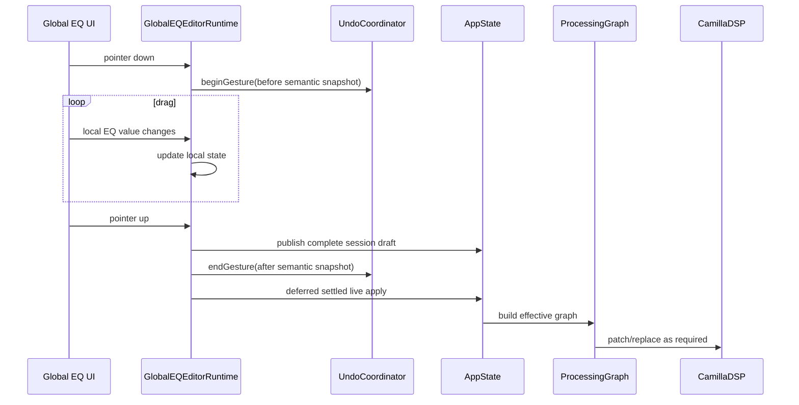
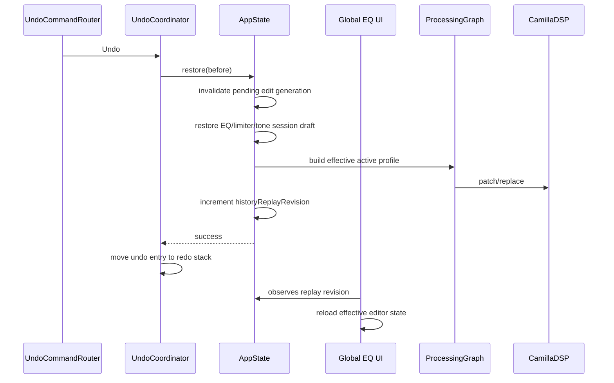
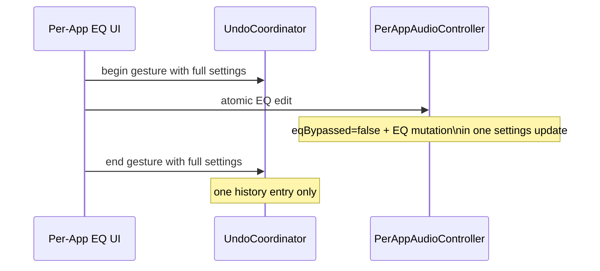
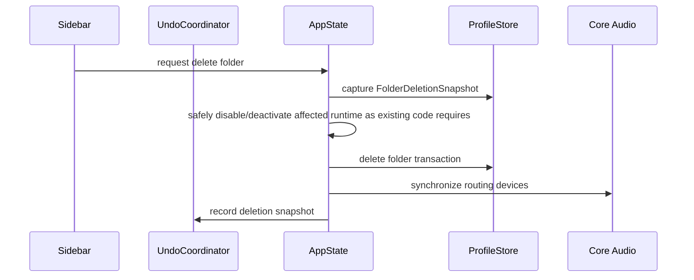
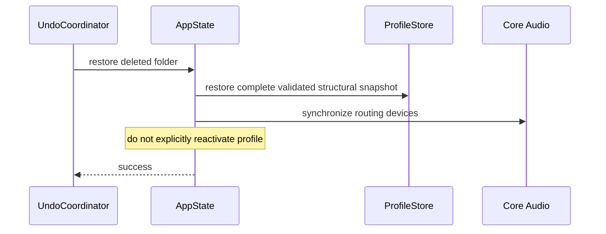

# CamiTune Undo / Redo — Repository-Specific Architecture Plan

**Repository:** `Shuail135/CamiTune`  
**Target branch reviewed:** `main`  
**Review date:** 2026-09-14  
**Purpose:** Convert the product-level undo/redo plan into an implementation architecture that fits the current CamiTune codebase and its existing state, draft, persistence, live-DSP, per-app, profile, and spatial editing paths.

---

# 0. Executive Architecture Decision

CamiTune should implement undo/redo as a **single application-level semantic history**, but it should **not** be a generic snapshot system and it should **not** be implemented by registering arbitrary SwiftUI setter closures.

The architecture should be:

```text
User gesture / command
        │
        ▼
Existing editor action boundary
        │
        ├── capture semantic "before" state
        │
        ├── perform existing live edit
        │
        └── capture semantic "after" state
                │
                ▼
        UndoCoordinator
        global chronological history
                │
      ┌─────────┴─────────┐
      │                   │
     Undo                Redo
      │                   │
      ▼                   ▼
 AppState / domain restoration layer
      │
      ├── restore session draft where appropriate
      ├── restore persistent store where appropriate
      ├── persist through existing owner
      └── apply active profile once if required
                │
                ▼
       ProcessingGraph / graph diff
                │
                ▼
             CamillaDSP
```

The most important implementation rule is:

> **History stores semantic user state, not storage mechanics, not SwiftUI bindings, and not CamillaDSP configuration.**

The second most important rule is:

> **Undo restoration must go through the domain owner that already owns persistence/runtime side effects.**

This leads to different restore paths for different CamiTune areas:

- Global EQ / per-channel EQ → restore **session editing state** in `AppState`.
- Per-app audio → restore the complete `PerAppAudioSettings` value through `PerAppAudioController`.
- Crossfeed / convolution → restore processing-stage state through new `AppState` processing mutation APIs.
- App alias/order/hide → restore presentation-only slices through `AppPresentationStore`.
- Profile/folder organization → restore through `ProfileStore` structural APIs.
- Profile rename → restore through `AppState.renameProfile`, because rename also synchronizes the macOS routing endpoint.
- Reference correction and speaker editing → require a small state-ownership refactor before they can support robust global undo.
- Activation, routing, driver repair, device switching, monitoring and other runtime operations remain outside history.

---

# 1. Current Repository Architecture Relevant to Undo

The current implementation already contains many of the boundaries needed for a clean undo system. The architecture should build on these instead of introducing a second editing model.

## 1.1 Application composition

Relevant files:

```text
Sources/CamiTune/CamiTune.swift
Sources/CamiTune/MainWindowCommandCoordinator.swift
Sources/CamiTune/AppState.swift
```

Current structure:

```text
CamiTuneMain
    │
    ▼
CamiTunePresentationCoordinator.shared
    │
    ├── AppState
    │
    └── MainWindowCommandCoordinator
            │
            ├── menu commands
            ├── profile actions
            └── main-window presentation commands
```

`CamiTunePresentationCoordinator` owns one shared `AppState`, and both the manually hosted main window and menu-bar UI use that state.

That makes `AppState` the correct lifetime boundary for the history service.

### Recommendation

Add:

```swift
@MainActor
final class AppState: ObservableObject, HistoryRestoring {
    let history: UndoCoordinator

    // ...
}
```

Do **not** create one undo manager per editor.

Do **not** create one undo manager per profile.

Do **not** put history inside `ProfileStore`, `PerAppAudioController`, or individual SwiftUI views.

Those components should expose restoration operations, but chronology belongs at application scope.

---

# 2. Current Editing Model: Important Consequences

CamiTune currently has several distinct editing patterns.

They must remain distinct.

## 2.1 Session-draft editing

Used by:

- Global EQ
- Limiter
- Simple tone
- Per-channel EQ
- Per-channel gain
- Per-channel delay

Relevant files:

```text
AppState.swift
GlobalEqualizerEditorActions.swift
GlobalEQEditorRuntime.swift
PerChannelProcessingActions.swift
PerChannelEditorRuntime.swift
```

These editors maintain a local editing model while `AppState` also stores unsaved session drafts.

For Global EQ, the current flow is conceptually:

```text
SwiftUI editor state
        │
        ▼
publishCurrentEQDraft()
        │
        ├── setEQDraft(...)
        ├── setLimiterDraft(...)
        └── setToneDraft(...)
        │
        ▼
debounced live apply
        │
        ▼
state.apply(profile:)
```

`Save` writes the editor state into the actual `DeviceProfile` and then clears the EQ session draft.

This has a very important undo consequence.

### History must not store "draft existence"

Consider:

```text
Saved profile = A

Edit:
A → B

History:
A → B

Press Save:
Persisted profile = B
Session draft = nil

Press Undo:
expected effective editor state = A
```

If history stored only:

```text
beforeDraft = nil
afterDraft = "B"
```

then undo after Save would restore `nil`, which now means persisted `B`, not the original `A`.

That is wrong.

Therefore Global EQ and per-channel history must store **resolved semantic editor values**.

---

# 3. Target Source Layout

Add a small undo subsystem.

Recommended files:

```text
Sources/CamiTune/
    UndoCoordinator.swift
    UndoHistoryModels.swift
    UndoCommandRouter.swift
    UndoRestoration.swift
```

Optional later split if the file becomes large:

```text
Sources/CamiTune/
    Undo/
        UndoCoordinator.swift
        UndoHistoryModels.swift
        UndoCommandRouter.swift
        UndoRestoration.swift
        UndoProfileRestoration.swift
        UndoAudioRestoration.swift
```

The first version does not need a framework or package.

Keep it in the CamiTune app target.

---

# 4. Core History Model

History entries should be pure values.

Do **not** store arbitrary closures in each entry.

Reasons:

- closures can retain views/controllers;
- they make history difficult to inspect and test;
- they encourage view-layer restoration;
- async restoration becomes difficult to reason about;
- typed state makes accidental cross-domain overwrites much harder.

Recommended shape:

```swift
struct HistoryEntry: Identifiable, Equatable, Sendable {
    let id: UUID

    let actionName: String
    let contextName: String?

    let target: HistoryTarget

    let before: HistoryState
    let after: HistoryState

    let coalescingKey: HistoryCoalescingKey?
}
```

## 4.1 History target

```swift
enum HistoryTarget: Hashable, Sendable {
    case profile(UUID)

    case profileChannel(
        profileID: UUID,
        channelIndex: Int
    )

    case application(String)

    case applicationPresentation(String)

    case applicationPresentationDocument

    case profileOrganization

    case speakerSystem(UUID)

    case referenceCorrection(UUID)
}
```

`HistoryTarget` identifies **where** the state belongs.

It does not describe how to restore it.

---

# 5. Typed History State

Use small domain slices.

Recommended top-level enum:

```swift
enum HistoryState: Equatable, Sendable {
    case globalEQ(GlobalEQHistoryState)

    case channel(PerChannelHistoryState)

    case crossfeed(CrossfeedHistoryState)

    case convolution(ConvolutionHistoryState)

    case perAppAudio(PerAppAudioSettings)

    case appAlias(AppAliasHistoryState)

    case appPlacement(AppPlacementHistoryState)

    case profileName(ProfileNameHistoryState)

    case profileOrganization(ProfileOrganizationHistoryState)

    case deletedProfile(ProfileDeletionSnapshot)

    case deletedFolder(FolderDeletionSnapshot)

    case referenceCorrection(ReferenceCorrectionHistoryState)

    case referenceTransfer(ReferenceTransferHistoryState)

    case speakerSystem(SpeakerSystemHistoryState)
}
```

Not every case needs to exist on day one.

The enum is the final intended shape.

---

# 6. UndoCoordinator

Recommended owner:

```swift
@MainActor
final class UndoCoordinator: ObservableObject {
    @Published private(set) var undoTitle: String?
    @Published private(set) var redoTitle: String?
    @Published private(set) var isReplaying = false

    private var undoStack: [HistoryEntry] = []
    private var redoStack: [HistoryEntry] = []

    private var activeGestures: [GestureKey: ActiveGesture] = [:]

    weak var restorer: (any HistoryRestoring)?

    let capacity: Int

    init(capacity: Int = 150) {
        self.capacity = capacity
    }
}
```

Recommended session limit:

```text
150 semantic operations
```

This sits in the middle of the original 100–200 target and is large enough for real editing sessions without making destructive snapshots unbounded.

History remains memory-only.

---

# 7. Restoration Protocol

Restoration should be async because some CamiTune operations may need to:

- persist;
- rebuild/patch DSP state;
- synchronize routing-device metadata;
- await an existing domain transaction.

Recommended protocol:

```swift
@MainActor
protocol HistoryRestoring: AnyObject {
    func restoreHistoryState(
        _ state: HistoryState,
        target: HistoryTarget
    ) async throws
}
```

`AppState` should conform.

The coordinator controls chronology.

`AppState` controls domain restoration.

---

# 8. Replay Failure Semantics

Do not move an entry between stacks before restoration succeeds.

Correct undo:

```swift
func undo() async {
    guard !isReplaying,
          let entry = undoStack.last,
          let restorer else { return }

    isReplaying = true
    defer { isReplaying = false }

    do {
        try await restorer.restoreHistoryState(
            entry.before,
            target: entry.target
        )

        undoStack.removeLast()
        redoStack.append(entry)
        refreshTitles()
    } catch {
        // entry remains on undoStack
        // AppState surfaces the error
    }
}
```

Redo mirrors this using `entry.after`.

This prevents:

```text
history says undo succeeded
but audio/profile restoration actually failed
```

---

# 9. Recording Suppression During Replay

Undo/redo must never create a new undo operation.

Add:

```swift
var isRecordingEnabled: Bool {
    !isReplaying
}
```

All history registration methods return immediately during replay.

Domain setters should **not** individually ask whether they are replaying.

The semantic action boundary decides whether to record.

This keeps normal store/controller APIs reusable.

---

# 10. Continuous Gesture API

Use explicit begin/end boundaries.

```swift
func beginGesture(
    key: GestureKey,
    actionName: String,
    contextName: String?,
    target: HistoryTarget,
    before: HistoryState
)

func endGesture(
    key: GestureKey,
    after: HistoryState
)
```

Internal state:

```swift
struct ActiveGesture {
    var actionName: String
    var contextName: String?
    var target: HistoryTarget
    var before: HistoryState
}
```

At end:

```text
before == after
    → discard

before != after
    → append one HistoryEntry
```

New committed user edit clears `redoStack`.

---

# 11. Reuse Existing Continuous-Editing Boundaries

This is one of the biggest advantages of the current codebase.

## Global EQ

`GlobalEqualizerEditorActions.swift` already has:

```swift
continuousEditingChanged(_ isEditing: Bool)
```

and already waits until the edit finishes before doing expensive settled work.

Add history only on depth transitions:

```text
continuousEditDepth 0 → 1
    capture before
    beginGesture

continuousEditDepth 1 → 0
    capture after
    endGesture
```

Do not register history inside:

```text
graphicEQChanged()
publishCurrentEQDraft()
scheduleDeferredGraphicEQCommit()
state.apply(...)
```

Those are implementation mechanics, not user actions.

## Per-channel processing

`PerChannelProcessingActions.swift` has the same pointer-down/pointer-up architecture.

Use exactly the same history lifecycle.

## Crossfeed

`CrossfeedEditorView` already has:

- `continuousEditDepth`;
- `pendingCommitGeneration`;
- debounced persistence;
- `Slider(onEditingChanged:)`.

That means crossfeed can be integrated without changing its user interaction model.

Again:

```text
begin drag → capture
intermediate commit() calls → no history
end drag → one history entry
```

---

# 12. Protection Against Stale Deferred Commits

Undo may occur while a 50–250 ms deferred editor task is still sleeping.

Without protection:

```text
user releases slider
    ↓
history entry recorded
    ↓
user immediately presses ⌘Z
    ↓
undo restores old state
    ↓
old deferred task wakes
    ↓
old task writes the edited state again
```

That would make undo appear broken.

Some editors already protect themselves using local generation counters, but the protection is not global across history replay.

Add two AppState counters:

```swift
@Published private(set) var historyReplayRevision: UInt64 = 0

private(set) var editGeneration: UInt64 = 0
```

At replay start:

```swift
editGeneration &+= 1
```

At successful replay completion:

```swift
historyReplayRevision &+= 1
```

Deferred edit tasks capture:

```swift
let generation = state.editGeneration
```

and check before writing/applying:

```swift
guard generation == state.editGeneration else { return }
```

Views that hold local editor state observe:

```swift
.onChange(of: state.historyReplayRevision) {
    reloadFromEffectiveState()
}
```

This solves two separate problems:

1. stale pending tasks cannot overwrite restored state;
2. local SwiftUI editor state visibly updates after undo/redo.

Do not use one counter for both purposes; replay invalidation should happen before async restoration begins, while UI reload should happen after the restored state is authoritative.

---

# 13. Global EQ Architecture

Relevant current files:

```text
GlobalEqualizerEditorView.swift
GlobalEqualizerEditorActions.swift
GlobalEQEditorRuntime.swift
AppState.swift
ProcessingProfile.swift
ProcessingGraph.swift
ProcessingGraphDiff.swift
```

## 13.1 Snapshot

Recommended:

```swift
struct GlobalEQHistoryState: Equatable, Sendable {
    var preampDB: Double
    var bands: [EQBand]

    var limiterEnabled: Bool
    var simpleTone: SimpleToneSettings

    var replacesDeviceCorrection: Bool
    var deviceCorrectionProvenance: DeviceCorrectionProfile?
}
```

This is a semantic editing state.

Do **not** store only Equalizer APO text.

APO text is currently a serialization/persistence representation; it should not define history identity.

## 13.2 Capture

Capture from the effective editor model:

```swift
GlobalEQHistoryState(
    preampDB: preampDB,
    bands: graphicBands,
    limiterEnabled: limiterEnabled,
    simpleTone: simpleTone,
    replacesDeviceCorrection: state.eqDraftReplacesDeviceCorrection(for: profile.id),
    deviceCorrectionProvenance: ...
)
```

For a discrete operation such as import/reset:

```text
before = current semantic EQ state

perform import/reset

after = current semantic EQ state

history.record(...)
```

## 13.3 Restore

Add:

```swift
func restoreGlobalEQHistoryState(
    _ snapshot: GlobalEQHistoryState,
    profileID: UUID
) async throws
```

The restore method must:

1. find the current persisted profile;
2. serialize `snapshot.bands` and `snapshot.preampDB` using the existing APO serializer;
3. write session EQ, limiter, and tone drafts;
4. restore correction-replacement/provenance draft semantics;
5. publish one logical draft revision;
6. if the profile is active, apply the effective profile once;
7. leave the editor **unsaved** when the snapshot differs from the saved profile.

### Critical Save case

```text
Persisted A
Edit B
Save B
Undo
```

Result:

```text
Persisted profile remains B
Session draft becomes A
Editor shows A / Unsaved
```

This preserves the rule:

> Save itself is not an undo action.

Redo:

```text
Session draft becomes B
```

which may compare equal to the saved profile.

The restore helper may then normalize away redundant drafts if desired, but only if doing so preserves the same effective semantic state.

---

# 14. Global EQ Discrete Action Boundaries

Record these as one entry each:

```text
Reset Equalizer
Import Equalizer APO File
Paste Equalizer APO Text
Change EQ Band Count
Recalculate EQ Bands
Load Device Correction into User EQ
Toggle Limiter
Toggle Individual Band
Change Filter Type
```

For continuous values:

```text
Band gain drag
Band frequency drag
Band Q drag
Preamp drag
Simple-tone drag
```

one completed interaction = one entry.

For keyboard nudging:

```text
same target + same control + short time window
    → coalesce
```

Recommended merge window:

```text
400 ms
```

---

# 15. Per-Channel Processing Architecture

Relevant current files:

```text
PerChannelProcessingView.swift
PerChannelProcessingActions.swift
PerChannelEditorRuntime.swift
AppState.swift
```

The current runtime already exposes a complete settled snapshot (`runtime.snapshot`).

Reuse it.

If the existing snapshot type does not already conform to `Equatable` and `Sendable`, add those conformances or introduce a thin DTO.

Recommended semantic payload:

```swift
struct PerChannelHistoryState: Equatable, Sendable {
    var gainDB: Double
    var delayMilliseconds: Double
    var limiterEnabled: Bool
    var bands: [EQBand]
    var simpleTone: SimpleToneSettings
}
```

If the current `PerChannelEditorSnapshot` already contains these exact fields, use that type directly rather than creating a duplicate.

Target:

```swift
.profileChannel(
    profileID: profile.id,
    channelIndex: selectedChannelIndex
)
```

Restore through a new AppState method:

```swift
func restoreChannelHistoryState(
    _ snapshot: PerChannelHistoryState,
    profileID: UUID,
    channelIndex: Int
) async throws
```

It should write a complete per-channel session draft in one operation.

Do not restore gain, delay, limiter and EQ as four independent setter calls.

That would:

- create unnecessary publication;
- create unnecessary live applies;
- expose transient mixed states;
- make atomic undo less reliable.

---

# 16. Crossfeed Architecture

Current `CrossfeedEditorView` owns:

```text
settings
isEnabled
continuousEditDepth
pendingCommitGeneration
liveApplyTask
```

Current persistence eventually does:

```text
updated.processing.setCrossfeed(...)
profile = updated
if active → state.apply(profile:)
```

## 16.1 Snapshot

```swift
struct CrossfeedHistoryState: Equatable, Sendable {
    var processor: CrossfeedProcessor
    var isEnabled: Bool
}
```

## 16.2 View integration

At drag start:

```swift
history.beginGesture(
    key: .crossfeed(profile.id, controlID),
    actionName: "Adjust Crossfeed",
    contextName: profile.name,
    target: .profile(profile.id),
    before: .crossfeed(currentSnapshot)
)
```

At drag end:

```swift
history.endGesture(
    key: ...,
    after: .crossfeed(currentSnapshot)
)
```

Toggle:

```text
capture before
change isEnabled
commit
capture after
record one entry
```

## 16.3 Restore path

Do not call a private view `persist(...)`.

Move the domain mutation into `AppState`.

Recommended:

```swift
func setCrossfeedHistoryState(
    _ snapshot: CrossfeedHistoryState,
    profileID: UUID
) async throws
```

Internally:

```text
find current profile
    ↓
mutate current profile.processing.crossfeed
    ↓
profiles.update(updated)
    ↓
if active:
    merge any current session EQ drafts
    apply exactly once
```

After this exists, `CrossfeedEditorView.persist(...)` should also delegate to the same AppState domain method.

That gives normal edits and undo one authoritative path.

---

# 17. Convolution Architecture

Relevant files:

```text
ConvolutionEditorView.swift
ImpulseResponseStore.swift
ProcessingProfile.swift
AppState.swift
```

Current convolution editing writes directly through the bound profile and then live-applies when active.

## 17.1 Snapshot

Use the complete processing stage:

```swift
struct ConvolutionHistoryState: Equatable, Sendable {
    var processor: ConvolutionProcessor?
    var isEnabled: Bool
}
```

or, if the existing stage value is already suitable:

```swift
ProcessingStageValue<ConvolutionProcessor>?
```

## 17.2 Undoable actions

One entry each:

```text
Enable/Disable Convolution
Import IR
Replace IR
Remove IR
Change Impulse Channel
```

Import should only enter history after `ImpulseResponseStore.importWAV(...)` succeeds.

A failed importer creates no history.

## 17.3 Asset lifecycle

The current store imports WAV files into immutable application-managed storage.

That is already friendly to undo because a removed convolution stage does not currently imply that the underlying imported WAV must immediately be destroyed.

Therefore:

> Do not add a history-specific IR lease/reference-count system in the first undo implementation unless CamiTune also introduces asset garbage collection.

If future cleanup deletes orphaned IR files, then add:

```text
history reference
    → asset retained

history entry evicted
    → asset eligible for cleanup
```

before enabling that cleanup.

---

# 18. ProcessingGraph and CamillaDSP

Relevant files:

```text
ProcessingGraph.swift
ProcessingGraphDiff.swift
CamillaDSPController.swift
CamillaDSPManager.swift
```

The current graph differ already decides between:

```text
unchanged
patch(processors:)
replaceConfiguration
```

based on the semantic processing graph.

Undo should **not** store:

- CamillaDSP YAML/config;
- graph processor JSON;
- patch commands;
- graph topology snapshots solely for replay;
- WebSocket operations.

Instead:

```text
history semantic snapshot
        ↓
restore ProcessingProfile/session state
        ↓
existing graph builder
        ↓
ProcessingGraphDiffer
        ↓
smallest safe DSP update
```

This is a major architectural advantage.

History should remain engine-independent.

---

# 19. Per-App Audio Architecture

Relevant files:

```text
PerAppAudioController.swift
PerAppAudioView.swift
PerAppAudioPresentation.swift
```

Current `PerAppAudioSettings` already contains the correct undo slice:

```swift
struct PerAppAudioSettings {
    var volume: Double
    var isMuted: Bool
    var eqBypassed: Bool
    var equalizerBands: [EQBand]
    var playbackModeOverride: PlaybackMode?
    var simpleTone: SimpleToneSettings
}
```

Use the entire value as history state.

Do **not** create separate volume/EQ/bypass history payloads.

## 19.1 Add one atomic replacement API

Recommended public controller API:

```swift
func replaceSettings(
    _ settings: PerAppAudioSettings,
    for applicationID: String,
    persistChanges: Bool = true,
    forcePublication: Bool = true
)
```

Implementation should go through the controller's existing internal settings mutation machinery so it still performs:

- clamping/validation;
- revision updates;
- filter-state reset where required;
- headroom reset where required;
- persistence scheduling;
- publication.

Undo restoration becomes:

```swift
perAppAudio.replaceSettings(
    snapshot,
    for: applicationID
)
```

## 19.2 Volume gesture

Current controller already exposes:

```swift
setVolume(
    ...,
    interactionFinished: Bool
)
```

History should use the actual pointer gesture boundary, not every call.

```text
drag begins:
    capture full PerAppAudioSettings

drag moves:
    setVolume(... interactionFinished: false)

drag ends:
    setVolume(... interactionFinished: true)
    capture full PerAppAudioSettings
    record one entry
```

## 19.3 Bypassed EQ edit

Current UI can automatically turn EQ on when the user edits it.

History must capture:

```text
Before
eqBypassed = true
Band 1 = 0

After
eqBypassed = false
Band 1 = +5
```

as one `PerAppAudioSettings` transition.

Undo restores both.

### Recommended controller improvement

Instead of:

```text
setEQBypassed(false)
setEqualizerBands(...)
```

as two controller mutations, add an atomic EQ-edit helper:

```swift
func editEqualizer(
    for applicationID: String,
    interactionFinished: Bool,
    _ edit: (inout PerAppAudioSettings) -> Void
)
```

Inside one `updateSettings` operation:

```swift
settings.eqBypassed = false
edit(&settings)
```

This removes a transient half-state and makes runtime semantics match undo semantics.

## 19.4 Playback override

One picker selection = one history entry.

## 19.5 Set mode for all applications

If `setPlaybackModeForAllApplications` is exposed as one user action, do **not** create N history entries.

Create:

```swift
struct PerAppBatchAudioState {
    var settingsByApplicationID: [String: PerAppAudioSettings]
}
```

and restore it as one transaction.

---

# 20. App Presentation Architecture

Relevant file:

```text
AppPresentationStore.swift
```

The store intentionally owns UI identity/order separately from per-app audio settings.

Keep that separation.

Undoable:

- alias;
- hide/show;
- reorder;
- reset application ordering.

Not undoable:

- `equalizerPresentation` (`Bands / Simple / Both`);
- selection;
- expansion/view state.

## 20.1 Do not snapshot the whole AppPresentationDocument

The complete document contains non-undoable view preference state.

If history stores/restores the entire document, this can happen:

```text
1. user changes Bands → Both
2. user reorders Spotify
3. user changes Both → Simple
4. Undo reorder
```

A whole-document snapshot could accidentally revert `Simple` back to `Both`.

Therefore use typed slices.

### Alias

```swift
struct AppAliasHistoryState: Equatable, Sendable {
    var alias: String?
}
```

### Placement

```swift
struct AppPlacementHistoryState: Equatable, Sendable {
    var orderedApplicationIDs: [String]
    var hiddenByApplicationID: [String: Bool]
}
```

Hide/show changes both section membership and order, so placement should be atomic.

Add to `AppPresentationStore`:

```swift
func placementHistoryState() -> AppPlacementHistoryState

func restorePlacementHistoryState(
    _ state: AppPlacementHistoryState
)

func aliasHistoryState(for id: String) -> AppAliasHistoryState

func restoreAliasHistoryState(
    _ state: AppAliasHistoryState,
    for id: String
)
```

These methods should internally use the same persistence/publication discipline as `mutate`.

---

# 21. ProfileStore Architecture

Relevant file:

```text
ProfileStore.swift
```

Current store already owns:

- profile collection;
- physical-device defaults;
- folders;
- root order;
- selection;
- grouping;
- folder membership;
- drag/drop organization;
- batched persistence.

This is the correct domain owner for organization undo.

## 21.1 Do not restore organization by replacing complete DeviceProfiles

For reordering/membership, history should preserve current profile contents.

Bad:

```swift
beforeProfiles: [DeviceProfile]
```

for a simple reorder.

That can overwrite sound edits unrelated to the organization action.

Instead:

```swift
struct ProfileOrganizationHistoryState: Equatable, Sendable {
    var orderedProfileIDs: [UUID]

    var folders: [ProfileFolderOrganizationState]

    var rootOrder: [ProfileRootItem]
}

struct ProfileFolderOrganizationState: Equatable, Sendable {
    var id: UUID
    var profileIDs: [UUID]
}
```

The restore method reconstructs the profile array order using the **current** profile objects matched by ID.

Thus:

```text
restore ordering
≠
restore old audio/profile configuration
```

## 21.2 Store APIs

Add:

```swift
func organizationHistoryState() -> ProfileOrganizationHistoryState

func restoreOrganizationHistoryState(
    _ state: ProfileOrganizationHistoryState
) throws
```

Restoration should run inside `performBatchUpdate`.

It must validate:

- all referenced profile IDs still exist;
- folder IDs are valid;
- no profile belongs to multiple folders;
- root items are valid;
- no duplicate IDs.

If validation fails, throw and leave history at its previous stack position.

---

# 22. Profile Rename

Profile rename is not a plain `ProfileStore.update`.

Current `AppState.renameProfile` also synchronizes the profile routing-device metadata with Core Audio.

Therefore:

> Profile rename undo/redo must call the same AppState rename path.

Snapshot:

```swift
struct ProfileNameHistoryState: Equatable, Sendable {
    var name: String
}
```

Record only after the text edit commits.

While the field is actively being edited, native NSTextView undo should remain responsible for character-level undo.

---

# 23. Delete Profile

Deletion should use a **targeted composite snapshot**, not a giant entire-app snapshot.

Recommended:

```swift
struct ProfileDeletionSnapshot: Equatable, Sendable {
    var profile: DeviceProfile

    var originalProfileIndex: Int

    var folderID: UUID?
    var folderChildIndex: Int?

    var rootOrder: [ProfileRootItem]

    var physicalDeviceDefaults: [PhysicalDeviceDefaultProfile]

    var selectedProfileID: UUID?
}
```

Only include relationships that deletion actually mutates.

Do not include:

- unrelated app presentation;
- per-app audio;
- meters;
- current spectrum;
- window state;
- CamillaDSP runtime object state.

## 23.1 Restore API

Add a store-level structural operation:

```swift
func restoreDeletedProfile(
    _ snapshot: ProfileDeletionSnapshot
) throws
```

or an AppState wrapper if Core Audio endpoint synchronization is required:

```swift
func restoreDeletedProfileHistory(
    _ snapshot: ProfileDeletionSnapshot
) async throws
```

Recommended flow:

```text
validate no conflicting profile ID/name
        ↓
restore profile and organization atomically
        ↓
restore physical-device default relationships
        ↓
restore selection if appropriate
        ↓
persist
        ↓
synchronize profile routing devices
```

## 23.2 Runtime policy

Deleting an active profile may deactivate it.

Undo deletion should restore the logical profile data, but it should **not explicitly call activate()**.

In v1:

```text
restore profile
restore enabled/automatic metadata as recorded
do not explicitly reconnect/switch the current audio route
```

This keeps activation itself outside undo history.

Normal future routing/device events can continue to follow CamiTune's existing activation policy.

---

# 24. Delete Folder

Folder deletion currently affects:

- folder metadata;
- every contained profile;
- profile ordering;
- root ordering;
- automatic physical-device defaults;
- current selection;
- possibly live activation/routing before deletion.

Snapshot:

```swift
struct FolderDeletionSnapshot: Equatable, Sendable {
    var folder: ProfileFolder

    var rootIndex: Int?

    var profiles: [DeletedProfilePlacement]

    var rootOrder: [ProfileRootItem]

    var physicalDeviceDefaults: [PhysicalDeviceDefaultProfile]

    var selectedProfileID: UUID?
}

struct DeletedProfilePlacement: Equatable, Sendable {
    var profile: DeviceProfile
    var globalProfileIndex: Int
    var folderChildIndex: Int
}
```

Restore through an AppState/domain operation.

Do not restore by repeatedly calling:

```text
add profile
add profile
add folder
move profile
move profile
```

That would expose transient invalid states and trigger repeated persistence/runtime work.

Restore the complete validated structural transaction once.

---

# 25. Reference Correction: Required Ownership Refactor

Relevant files:

```text
ReferenceCorrection.swift
ReferenceCorrectionView.swift
CorrectionFilterTable.swift
```

Current `ReferenceCorrectionView` keeps:

```swift
@State private var draft: DeviceCorrectionProfile?
@State private var snapshot: DeviceProfile?
```

The filter table mutates this local draft.

This is a problem for a truly global chronological undo system.

If an unsaved correction edit only exists in a SwiftUI view:

```text
edit correction
navigate away
undo from another screen
```

the global history owner has no authoritative state to restore into if that view has been destroyed.

Therefore robust reference-correction undo requires moving the editing session out of transient view-local state.

## 25.1 Add a reference-correction edit session

Recommended:

```swift
@MainActor
final class ReferenceCorrectionEditSessionStore: ObservableObject {
    struct Session: Equatable {
        var profileID: UUID
        var baseline: DeviceCorrectionProfile?
        var draft: DeviceCorrectionProfile?
    }

    private var sessions: [UUID: Session] = [:]
}
```

This can be owned by `AppState`.

The view binds to the session rather than holding the only draft.

Then history can target:

```swift
.referenceCorrection(profile.id)
```

and restore unsaved correction edits even when the correction view is not currently visible.

## 25.2 Import / Paste / Clear

One operation = one history entry.

## 25.3 Filter editing

For sliders/tables:

- continuous controls use gesture grouping;
- a committed field change is one semantic edit;
- active NSTextField typing continues using native text undo until commit.

## 25.4 Save Correction

Save itself is not history.

Same semantic rule as Global EQ:

```text
edit A → B
Save B
Undo
```

should result in:

```text
persisted B
unsaved correction draft A
```

if full unsaved correction history is implemented.

---

# 26. Import Reference Correction to Equalizer

Current `AppState.importReferenceToEqualizer(...)` is already an application-level transaction that changes multiple logical areas:

- Reference Correction;
- User EQ processing;
- potentially limiter/tone merge behavior;
- section layout visibility.

This is exactly the kind of action that should be one history entry.

Snapshot:

```swift
struct ReferenceTransferHistoryState: Equatable, Sendable {
    var correction: DeviceCorrectionProfile?

    var globalEQ: GlobalEQHistoryState

    var sectionLayout: ProfileSectionLayout?
}
```

The exact DTO can be adjusted to current model types, but the unit of restoration must remain composite.

Undo:

```text
Reference correction X
User EQ A
layout L1
        ↓
restore all three atomically
```

Redo:

```text
Reference correction nil
User EQ X
layout L2
```

Do not replay `ReferenceCorrection.transfer(...)` on redo if doing so would recalculate anything based on current state.

Redo should restore the captured after-state.

---

# 27. Speaker / Listener Editing: Required Ownership Refactor

The spatial/speaker subsystem has a similar issue to Reference Correction.

The current speaker editor keeps important draft state locally while the user is editing before Save.

For application-wide chronological undo, the draft needs a stable owner.

Recommended:

```swift
@MainActor
final class SpeakerEditSessionStore: ObservableObject {
    struct Session: Equatable {
        var profileID: UUID
        var baseline: SpeakerSystemHistoryState
        var draft: SpeakerSystemHistoryState
    }

    private var sessions: [UUID: Session] = [:]
}
```

Possible history payload:

```swift
struct SpeakerSystemHistoryState: Equatable, Sendable {
    var topology: SpeakerTopology?
    var listenerPosition: ListenerPosition?
}
```

Adapt the exact fields to the existing speaker model.

## 27.1 Drag lifecycle

The room canvas has natural mouse lifecycle boundaries.

Expose callbacks such as:

```swift
onSpeakerMoveStarted: (SpeakerID) -> Void
onSpeakerMoveEnded: (SpeakerID) -> Void

onListenerMoveStarted: () -> Void
onListenerMoveEnded: () -> Void
```

During `mouseDragged`:

```text
update draft only
no history entry
```

At `mouseUp`:

```text
capture after
one history entry
```

## 27.2 Excluded canvas interactions

Never register:

- pan;
- zoom;
- reset view;
- selected speaker;
- audition/test.

These are not document edits.

## 27.3 Discover Channels

Hardware discovery is an external observation.

Correct history:

```text
Before speaker draft
        ↓
perform discovery ONCE
        ↓
captured resulting topology
```

History entry:

```text
before = old draft
after  = discovered draft
```

Redo:

```text
restore captured discovered draft
```

Do **not** rerun hardware discovery.

---

# 28. Save Semantics Across Editors

Use one consistent rule:

> Save changes storage location; it does not change the semantic user state.

Therefore Save does not create history.

This applies to:

- Global EQ;
- per-channel processing;
- Reference Correction;
- speaker editing;
- future Profile Settings transaction history.

History snapshots should describe what the editor **means**, not whether the value currently resides in:

- a SwiftUI `@State`;
- an AppState session draft;
- persisted `DeviceProfile`;
- a store file.

---

# 29. Command Architecture and Native Text Undo

Relevant current file:

```text
MainWindowCommandCoordinator.swift
```

`CamiTuneCommands` already replaces several standard command groups but currently does not own application semantic undo.

Add:

```swift
@MainActor
final class UndoCommandRouter: ObservableObject {
    let history: UndoCoordinator

    // observes/re-evaluates native text undo availability
}
```

Then:

```swift
struct CamiTuneCommands: Commands {
    @ObservedObject var coordinator: MainWindowCommandCoordinator
    @ObservedObject var undo: UndoCommandRouter

    var body: some Commands {
        CommandGroup(replacing: .undoRedo) {
            Button(undo.undoMenuTitle) {
                undo.performUndo()
            }
            .keyboardShortcut("z", modifiers: .command)
            .disabled(!undo.canUndo)

            Button(undo.redoMenuTitle) {
                undo.performRedo()
            }
            .keyboardShortcut("z", modifiers: [.command, .shift])
            .disabled(!undo.canRedo)
        }

        // existing commands...
    }
}
```

## 29.1 Native text precedence

At execution time:

```swift
func performUndo() {
    if let manager = nativeTextUndoManager(),
       manager.canUndo {
        manager.undo()
        refresh()
        return
    }

    Task {
        await history.undo()
    }
}
```

`nativeTextUndoManager()` should only claim editable text responders, for example an active `NSTextView`/field editor.

Do not treat every window undo manager as text editing.

## 29.2 Menu titles

When a native text editor is first responder:

```text
Undo Typing
Redo Typing
```

should come from that undo manager when available.

Otherwise:

```text
Undo Adjust EQ Gain — Studio Monitors
Redo Adjust EQ Gain — Studio Monitors
```

comes from `UndoCoordinator`.

The router can refresh on:

- text begin/end editing;
- text changes / undo-manager checkpoints;
- key-window changes;
- history stack changes.

Keyboard precedence is mandatory even if menu-title refresh is implemented in a second sub-step.

---

# 30. Global Chronology

Do not partition history by editor.

Example:

```text
1. Adjust Studio EQ
2. Move Left Speaker
3. Adjust Spotify Volume
4. Rename Spotify
5. Enable Crossfeed
```

Undo order:

```text
5 → 4 → 3 → 2 → 1
```

No editor navigation is required.

If an off-screen domain changes, optionally show:

```text
Undid Adjust Spotify Volume
```

but do not automatically navigate unless restoration itself requires selection.

Restoring a deleted profile is one of the few cases where reselecting the restored profile is reasonable.

---

# 31. Context Naming

Store a human-readable context at record time.

Examples:

```text
Adjust EQ Band 4 Gain — Studio Monitors
Reset Left Channel — Studio Monitors
Adjust Crossfeed — HD 800 S
Adjust Spotify Volume
Rename Spotify
Move Right Speaker — Living Room
Delete Profile — Desk DAC
```

Do not derive the title from the current object name during undo.

If an object was renamed after the original action, chronology may otherwise produce confusing menu text.

---

# 32. Discrete Recording API

Recommended:

```swift
func record(
    actionName: String,
    contextName: String?,
    target: HistoryTarget,
    before: HistoryState,
    after: HistoryState,
    coalescingKey: HistoryCoalescingKey? = nil
)
```

Behavior:

```text
if replaying → ignore
if before == after → ignore

append entry
clear redo
trim oldest if > capacity
publish titles
```

---

# 33. Keyboard/Repeated-Step Coalescing

Some controls can be changed using keyboard arrows repeatedly.

Use:

```swift
struct HistoryCoalescingKey: Hashable, Sendable {
    var target: HistoryTarget
    var control: String
}
```

If:

```text
same coalescing key
same action
same target
no intervening history entry
within ~400 ms
```

replace the previous entry's `after` state instead of appending.

Do not use this for text typing; native text undo owns that interaction.

---

# 34. External and Automatic Events

Never register history for:

- audio-device discovery;
- output-volume observations;
- per-app process discovery;
- application identity migration;
- auto activation;
- device hotplug;
- route repair;
- meters;
- spectrum;
- headroom recalculation;
- automatic graph rebuild;
- persistence migration;
- settings sanitation on load.

History registration occurs only at semantic user action boundaries.

---

# 35. Persistence Rules

Session-only undo history does **not** mean restored changes are temporary.

If normal user action persists immediately, undo should persist its restored value immediately as well.

Examples:

```text
App alias edit
    user action persists
    undo persists restored alias

Per-app volume
    user action persists at gesture end
    undo persists restored volume

Crossfeed
    profile mutation persists
    undo persists restored crossfeed
```

For session-draft editors:

```text
Global EQ unsaved edit
    history restores session draft
    does not automatically Save

Per-channel unsaved edit
    history restores session draft
```

History itself is never serialized.

---

# 36. Domain Restore Matrix

| Domain | History payload | Authoritative restore owner | Persist? | Live apply? |
|---|---|---|---:|---:|
| Global EQ | `GlobalEQHistoryState` | `AppState` session drafts | No, until Save | If active |
| Per-channel | `PerChannelHistoryState` | `AppState` session drafts | No, until Save | If active |
| Crossfeed | `CrossfeedHistoryState` | `AppState` processing mutation | Yes | If active |
| Convolution | `ConvolutionHistoryState` | `AppState` processing mutation | Yes | If active |
| Per-app audio | `PerAppAudioSettings` | `PerAppAudioController` | Yes | Controller runtime |
| App alias | alias slice | `AppPresentationStore` | Yes | No |
| App order/hide | placement slice | `AppPresentationStore` | Yes | No |
| Profile rename | name slice | `AppState.renameProfile` path | Yes | Sync endpoint label |
| Profile organization | ID/order/membership slice | `ProfileStore` | Yes | No |
| Delete profile/folder | composite structural snapshot | `AppState` + `ProfileStore` | Yes | No explicit activation |
| Reference correction | correction edit-session state | App-owned correction session / AppState | Draft or Save-dependent | If active when committed |
| Correction → EQ | composite correction+EQ+layout | `AppState` transaction | Yes + draft semantics | If active |
| Speaker edit | speaker edit-session state | App-owned speaker session | Draft or Save-dependent | On committed/live-supported changes |

---

# 37. AppState Restoration Dispatcher

Recommended:

```swift
extension AppState: HistoryRestoring {
    func restoreHistoryState(
        _ state: HistoryState,
        target: HistoryTarget
    ) async throws {
        editGeneration &+= 1

        switch (state, target) {

        case let (.globalEQ(snapshot), .profile(profileID)):
            try await restoreGlobalEQHistoryState(
                snapshot,
                profileID: profileID
            )

        case let (.channel(snapshot),
                  .profileChannel(profileID, channelIndex)):
            try await restoreChannelHistoryState(
                snapshot,
                profileID: profileID,
                channelIndex: channelIndex
            )

        case let (.crossfeed(snapshot), .profile(profileID)):
            try await restoreCrossfeedHistoryState(
                snapshot,
                profileID: profileID
            )

        case let (.convolution(snapshot), .profile(profileID)):
            try await restoreConvolutionHistoryState(
                snapshot,
                profileID: profileID
            )

        case let (.perAppAudio(snapshot), .application(applicationID)):
            perAppAudio.replaceSettings(
                snapshot,
                for: applicationID
            )

        // ...

        default:
            throw HistoryRestoreError.invalidStateForTarget
        }

        historyReplayRevision &+= 1
    }
}
```

A target/state mismatch should be a programmer-visible error.

Do not silently ignore it.

---

# 38. Apply Active Profile Only Once

Complex restore must never live-apply each field separately.

Bad:

```text
restore preamp → apply
restore bands → apply
restore limiter → apply
restore tone → apply
```

Good:

```text
restore all semantic fields
        ↓
build one effective profile
        ↓
state.apply(profile:) once
```

The existing processing graph differ can then decide whether this is a patch or full configuration replacement.

---

# 39. Profile Mutation Helper for Saved Processing Stages

Crossfeed and convolution currently have view-local persistence implementations.

Extract the repeated domain logic.

Possible helper:

```swift
@MainActor
func mutateSavedProcessing(
    profileID: UUID,
    _ mutate: (inout ProcessingProfile) throws -> Void
) async throws {
    guard var profile = profiles.profiles.first(where: { $0.id == profileID })
    else { throw HistoryRestoreError.missingProfile }

    var processing = try profile.resolvedProcessing()

    try mutate(&processing)

    profile.processing = processing
    profiles.update(profile)

    if profileID == activeProfileID, isActive {
        let effective = try applyingSessionEQDrafts(to: profile)
        await apply(profile: effective)
    }
}
```

Adjust for the exact current `ProcessingProfile`/legacy compatibility API.

Then both ordinary Crossfeed/Convolution edits and history replay use the same path.

---

# 40. Why AppState Should Be the Restoration Hub

`AppState` already knows:

- which profile is active;
- whether transitions are in progress;
- how session EQ drafts overlay saved state;
- how to live-apply a profile;
- how profile settings are transactionally saved;
- how profile rename affects Core Audio routing devices;
- how folder deletion safely interacts with active runtime.

No individual view or store has all of that context.

Therefore history restoration belongs above those domain owners but below UI.

---

# 41. Do Not Put History Inside ProcessingGraph

`ProcessingGraph` is a derived runtime representation.

It is not the editor/document model.

If history operates on graphs:

- profile semantics become coupled to CamillaDSP;
- imports and Save semantics become harder to represent;
- per-app audio/presentation cannot share the same system naturally;
- graph topology changes become mistaken for user action boundaries;
- redo may replay stale runtime assumptions.

Keep graph diff exactly where it is: after semantic state restoration.

---

# 42. Profile Settings Save — Later Phase Only

Current `saveProfileSettings` already behaves like a transaction:

- checks busy/transition state;
- validates the original/staleness;
- constructs a candidate;
- validates runtime/device conditions;
- commits through the profile store;
- coordinates live apply/rollback behavior.

If Profile Settings Save becomes undoable later, do not implement:

```swift
profiles.update(oldProfile)
```

Instead introduce a reusable settings transaction layer so history can submit a previous settings candidate through the same rules.

Possible later architecture:

```text
ProfileSettingsTransaction
    ├── validate
    ├── prepare runtime
    ├── persist candidate
    ├── synchronize route metadata
    ├── apply/restart if needed
    └── rollback on failure
```

Then:

```text
normal Save
undo Save-related settings transaction
redo settings transaction
```

all reuse the same mechanism.

This remains intentionally outside v1.

---

# 43. Actions Explicitly Excluded

Do not add history to:

```text
Enable/Disable Profile
Activate/Deactivate Profile
Automatic Activation
macOS Default Output Changes
Core Audio Routing Changes
Driver Install/Repair
Driver Recheck
Device Discovery
Runtime Process Start/Stop
Meter/Spectrum State
Speaker Audition
Pan/Zoom
Sidebar Selection
Expand/Collapse
Equalizer Presentation Mode
```

Some excluded operations may happen as a consequence of a domain transaction, but they are not independently replayed as user history steps.

---

# 44. Recommended Implementation Phases

## Phase 0 — History Infrastructure

Add:

```text
UndoCoordinator.swift
UndoHistoryModels.swift
UndoCommandRouter.swift
UndoRestoration.swift
```

Implement:

- global stack;
- redo stack;
- 150-entry cap;
- new-edit redo invalidation;
- replay suppression;
- failure-safe stack movement;
- no-op detection;
- continuous gesture API;
- coalescing;
- native text precedence;
- `historyReplayRevision`;
- `editGeneration`;
- dynamic menu titles.

No feature editor needs to be converted simultaneously.

---

## Phase 1 — DSP Editors With Existing Natural Boundaries

Implement in this order:

1. Global EQ
2. Per-channel processing
3. Crossfeed
4. Convolution

Why:

- Global/per-channel already expose continuous editing lifecycle.
- Crossfeed already has drag grouping and generation-based debounce.
- Convolution is mostly discrete.
- These areas prove the semantic snapshot/restoration model before touching structural deletion.

Deliverable:

```text
⌘Z works reliably for the core sound editor
```

---

## Phase 2 — Per-App Audio

Implement:

- atomic `replaceSettings`;
- volume gesture history;
- mute;
- EQ;
- simple tone;
- EQ reset/band count;
- playback override;
- atomic bypass+edit;
- optional batch playback-mode snapshot.

Deliverable:

```text
per-app sound edits participate in the same chronological history
```

---

## Phase 3 — Presentation and Profile Organization

Implement:

- app alias;
- app hide/show;
- app reorder/reset;
- profile rename;
- folder rename;
- profile/folder drag/drop;
- root reordering;
- folder creation if desired.

Important:

- presentation snapshots exclude `equalizerPresentation`;
- organization snapshots store IDs/relationships, not old complete profile audio data;
- profile rename uses `AppState.renameProfile`.

---

## Phase 4 — Move Long-Lived Unsaved Drafts Out of Views

Refactor:

```text
ReferenceCorrectionView local draft
    → ReferenceCorrectionEditSessionStore

Speaker editor local draft
    → SpeakerEditSessionStore
```

Then add:

- reference-correction filter edits;
- correction import/paste/reset;
- correction transfer to EQ;
- speaker move;
- listener move;
- speaker role/name/height;
- Discover Channels result snapshot.

This phase is an architectural dependency for predictable cross-context undo.

---

## Phase 5 — Destructive Recovery

Implement:

- Delete Profile;
- Delete Folder;
- temporary “Deleted — Undo” affordance.

Add targeted composite snapshots and atomic restore APIs.

Update deletion confirmation copy that currently says deletion cannot be undone.

Do not explicitly reactivate restored profiles.

---

## Phase 6 — Optional Complex Runtime Settings

Only after all earlier phases are stable:

- Profile Settings Save;
- selected hardware-dependent settings.

Still do not add separate history steps for:

- activation;
- driver operations;
- macOS output changes.

---

# 45. Tests

Add dedicated history tests in addition to the existing processing/per-app/profile tests.

Recommended files:

```text
UndoCoordinatorTests.swift
UndoGlobalEQTests.swift
UndoPerChannelTests.swift
UndoCrossfeedTests.swift
UndoConvolutionTests.swift
UndoPerAppAudioTests.swift
UndoAppPresentationTests.swift
UndoProfileOrganizationTests.swift
UndoDeletionTests.swift
UndoReferenceCorrectionTests.swift
UndoSpeakerTests.swift
UndoCommandRoutingTests.swift
```

## 45.1 Coordinator tests

Verify:

```text
record A
record B
undo → B
undo → A
redo → A
redo → B
```

Verify:

```text
undo
new edit
redo unavailable
```

Verify:

```text
before == after
no entry
```

Verify capacity.

Verify failed restore does not move stack.

Verify replay cannot recursively register a new entry.

---

# 46. Global EQ Tests

Must include:

### Continuous drag

```text
start 1.2 dB
100 intermediate setter calls
end 5.7 dB

history count += 1

undo → 1.2
redo → 5.7
```

### No-op drag

```text
3 → 5 → 3
history count unchanged
```

### Save then undo

```text
persisted A
edit B
Save
persisted B / no draft

Undo

persisted B
effective editor A
unsaved = true
```

This is one of the most important regression tests in the entire feature.

### Pending debounce race

```text
edit
release
immediately undo
wait longer than debounce

restored value must remain
```

---

# 47. Per-Channel Tests

Verify:

- one gain drag = one entry;
- one delay drag = one entry;
- reset = one entry;
- EQ + implicit related state restores atomically;
- changing selected channel after a recorded edit does not change target identity;
- pending deferred commit cannot overwrite replay;
- Save then Undo has the same semantic-draft behavior as Global EQ.

---

# 48. Crossfeed Tests

Verify:

- drag creates one entry;
- intermediate debounced `commit()` calls do not create entries;
- toggle creates one entry;
- undo while a deferred commit is pending remains stable;
- inactive profile restoration does not start DSP;
- active profile restoration applies once.

---

# 49. Convolution Tests

Verify:

- import = one entry;
- failed import = zero entries;
- remove = one entry;
- change channel = one entry;
- undo remove restores same asset metadata;
- redo import does not re-open the file importer;
- asset file is still available after undo.

---

# 50. Per-App Tests

Verify:

### Volume

```text
drag across 200 intermediate values
history += 1
```

### Bypassed EQ

```text
before:
bypassed = true
band = 0

edit band

after:
bypassed = false
band = +5

undo:
bypassed = true
band = 0
```

one undo only.

### App disappears

If a persistent application ID is still valid in settings storage:

```text
undo should restore settings even if process is not currently running
```

For ephemeral process-only IDs, restoration should fail gracefully or remain session-only according to the existing identity policy.

---

# 51. App Presentation Tests

Verify:

```text
alias undo
hide/show undo
reorder undo
reset order undo
```

Critical regression:

```text
change equalizerPresentation
reorder app
change equalizerPresentation again
undo reorder
```

Result:

```text
latest equalizerPresentation remains unchanged
```

This proves the history slice is correctly scoped.

---

# 52. Profile Organization Tests

Verify:

- move into folder;
- move out of folder;
- reorder inside folder;
- reorder root item;
- rename folder;
- rename profile through AppState;
- automatic-device defaults remain unchanged during presentation-only reordering;
- organization undo does not overwrite a profile's later audio configuration.

---

# 53. Destructive Recovery Tests

## Profile

Delete and undo must restore:

- same profile ID;
- complete profile data;
- placement;
- folder membership;
- root ordering;
- physical-device default relationships;
- selection where appropriate.

It must not explicitly reactivate DSP.

## Folder

Restore:

- folder ID/name;
- every profile;
- child order;
- root order;
- physical-device defaults;
- selection.

One undo operation.

---

# 54. Reference Correction Tests

Verify:

- import/paste is one action;
- clear is one action;
- continuous filter edit coalesces;
- Save does not create history;
- Save then Undo produces an unsaved prior semantic state;
- Import to Equalizer restores correction + EQ + layout in one undo;
- redo uses captured after-state rather than rerunning calculation/import.

---

# 55. Speaker Tests

Verify:

- speaker mouse-down → drag → mouse-up = one entry;
- listener drag = one entry;
- role/name/height change = one entry;
- pan = zero entries;
- zoom = zero entries;
- audition = zero entries;
- Discover Channels = one entry;
- redo discovery does not invoke hardware discovery again.

Use a fake discovery service/counter for the last test.

---

# 56. Command Routing Tests

Verify:

```text
text field active + native undo available
⌘Z → text undo

text field inactive
⌘Z → CamiTune semantic undo

text field active but native stack empty
⌘Z → application undo
```

Also verify menu titles update correctly.

---

# 57. Key Race Conditions to Handle

## 57.1 Undo during debounce

Solved with `editGeneration`.

## 57.2 Undo during asynchronous restore

Disable semantic undo/redo while:

```text
history.isReplaying == true
```

Do not allow another history replay to start concurrently.

## 57.3 User changes profile during gesture

At profile change:

- finalize if a valid completed gesture exists;
- otherwise cancel active gesture state for the old target;
- never end a gesture using a different profile ID.

Gesture key must include the target profile/application identity.

## 57.4 Object deleted before older history replay

Global chronology normally means later deletion is undone before an earlier edit can be reached.

Still validate target existence on every replay.

Do not force-unpack historical targets.

## 57.5 Persistence failure

If domain restore can guarantee rollback, throw and retain history stack position.

If a persistence system currently publishes before discovering write failure, the history layer cannot magically provide transactionality; improve that domain's restore API rather than hiding the failure.

---

# 58. History Entry Lifetime and Assets

When the oldest history entry is evicted:

```text
remove it from memory
```

No other cleanup is required initially.

If future history states hold references to external managed assets that CamiTune begins garbage-collecting, introduce:

```text
AssetHistoryLease
```

or equivalent retain counts at that time.

Do not build this abstraction before an actual asset deletion lifecycle exists.

---

# 59. Memory/Performance

Normal semantic snapshots are small:

- EQ arrays: max ~20 bands;
- per-app settings: tiny;
- crossfeed: tiny;
- convolution metadata: tiny;
- organization: IDs/arrays.

Deletion snapshots can be larger, but they are rare.

At a 150-entry cap this is appropriate for an in-memory desktop editing history.

Do not attempt compression in v1.

---

# 60. Recommended Public API Summary

## UndoCoordinator

```swift
beginGesture(...)
endGesture(...)
cancelGesture(...)
record(...)
recordCoalescing(...)
undo()
redo()
clear()
```

## AppState

```swift
restoreHistoryState(...)
restoreGlobalEQHistoryState(...)
restoreChannelHistoryState(...)
restoreCrossfeedHistoryState(...)
restoreConvolutionHistoryState(...)
restoreReferenceTransferHistoryState(...)
restoreDeletedProfileHistory(...)
restoreDeletedFolderHistory(...)
```

## PerAppAudioController

```swift
replaceSettings(...)
editEqualizer(...)
```

## AppPresentationStore

```swift
aliasHistoryState(...)
restoreAliasHistoryState(...)

placementHistoryState()
restorePlacementHistoryState(...)
```

## ProfileStore

```swift
organizationHistoryState()
restoreOrganizationHistoryState(...)

captureProfileDeletionSnapshot(...)
captureFolderDeletionSnapshot(...)

restoreDeletedProfile(...)
restoreDeletedFolder(...)
```

## Reference correction

```text
ReferenceCorrectionEditSessionStore
```

## Speaker system

```text
SpeakerEditSessionStore
```

---

# 61. Suggested File-by-File Change Plan

## New

```text
UndoCoordinator.swift
UndoHistoryModels.swift
UndoCommandRouter.swift
UndoRestoration.swift
```

## Modify first

```text
AppState.swift
CamiTune.swift
MainWindowCommandCoordinator.swift
GlobalEqualizerEditorActions.swift
GlobalEQEditorRuntime.swift
PerChannelProcessingActions.swift
PerChannelEditorRuntime.swift
CrossfeedEditorView.swift
ConvolutionEditorView.swift
PerAppAudioController.swift
PerAppAudioView.swift
```

## Modify next

```text
AppPresentationStore.swift
Sidebar / profile organization views
ReferenceCorrection.swift
ReferenceCorrectionView.swift
SpeakerSystemView.swift
SpeakerRoomCanvas.swift
ProfileStore.swift
```

## Tests

Extend the current test target rather than creating a separate package.

---

# 62. Architecture Sequence: Global EQ Drag



Undo:



---

# 63. Architecture Sequence: Per-App EQ While Bypassed



Undo:

```text
replace entire PerAppAudioSettings with "before"
```

No special-case undo logic for bypass is required.

---

# 64. Architecture Sequence: Delete Folder



Undo:



---

# 65. Architectural Anti-Patterns to Avoid

Do not implement any of these:

## One UndoManager per view

Breaks global chronology.

## One UndoManager per profile

Cross-profile user actions become confusing.

## Register every SwiftUI Binding setter

Slider drag creates dozens/hundreds of entries.

## Store whole AppState snapshots

Undoing one EQ change could revert unrelated per-app state, navigation, runtime facts, meters, or device observations.

## Store complete DeviceProfile for every small profile organization action

Reorder undo could overwrite later audio edits.

## Replay user commands rather than restore result state

Examples to avoid:

```text
Redo Import WAV → reopen/re-import original file
Redo Discover Channels → probe hardware again
Redo Reference Transfer → recompute using current state
```

Redo restores the captured after-state.

## Undo CamillaDSP commands

CamillaDSP is derived runtime state.

## Put Save in history

Save changes persistence boundary, not semantic edit state.

## Restore deletion by manually appending one object to an array

Deletion touches multiple structural relationships.

---

# 66. Final Recommended Architecture

The final architecture should be thought of as four layers:

```text
┌─────────────────────────────────────────────┐
│ 1. Interaction Layer                        │
│ SwiftUI / AppKit gestures, buttons, menus   │
│ Defines semantic user-action boundaries     │
└──────────────────────┬──────────────────────┘
                       │
                       ▼
┌─────────────────────────────────────────────┐
│ 2. History Layer                            │
│ UndoCoordinator + typed before/after states │
│ Global chronology, grouping, coalescing     │
└──────────────────────┬──────────────────────┘
                       │
                       ▼
┌─────────────────────────────────────────────┐
│ 3. Domain Restoration Layer                 │
│ AppState / ProfileStore / PerApp controller │
│ Restores through authoritative APIs         │
└──────────────────────┬──────────────────────┘
                       │
                       ▼
┌─────────────────────────────────────────────┐
│ 4. Runtime / Persistence Layer              │
│ Profile persistence, graph diff, CamillaDSP │
│ Core Audio synchronization where required   │
└─────────────────────────────────────────────┘
```

The history layer knows:

```text
what the user changed
before
after
where it belongs
```

It does **not** know:

```text
how SwiftUI happens to store it
how CamillaDSP represents it
how JSON persistence is written
how Core Audio is synchronized
```

Those remain domain responsibilities.

---

# 67. First Production Milestone

A strong first production milestone is:

```text
Infrastructure
+ Global EQ
+ Per-channel processing
+ Crossfeed
+ Convolution
+ Per-app volume/mute/EQ
+ playback override
```

At that point the user can rely on:

```text
⌘Z = undo my last sound edit
```

which is the highest-value promise of the feature.

Then expand chronology into:

```text
organization
speaker editing
reference correction
deletion recovery
```

without changing the core history model.

---

# 68. Final Implementation Rule

For every new undoable feature, answer these five questions before writing code:

1. **What is the one semantic user action?**
2. **What is the smallest complete state slice that represents it?**
3. **Who currently owns/persists that state?**
4. **What domain API can restore it without bypassing invariants?**
5. **What asynchronous/debounced work could overwrite the replay afterward?**

If those five answers are clear, the feature belongs in the history system.

If they are not clear, fix the state ownership/domain boundary first rather than pushing undo logic into the view.

---

# 69. Bottom Line

CamiTune does **not** need a second state architecture for undo/redo.

The repository already has most of the right foundations:

- one application `AppState`;
- explicit profile/session draft separation;
- editor action/runtime separation;
- natural continuous gesture boundaries;
- typed processing models;
- graph diffing for efficient live updates;
- a dedicated per-app audio controller;
- a dedicated app-presentation store;
- a profile store with batched structural operations.

The architecture work is therefore mainly about adding a **semantic transaction/history layer between UI gestures and the existing domain owners**, plus fixing the two places where long-lived editable drafts are still view-local: Reference Correction and speaker editing.

The target behavior remains:

> **One meaningful user action = one undo step.**

The implementation counterpart should be:

> **One typed semantic before/after state = one history entry, restored through the domain owner, with runtime state derived afterward.**
